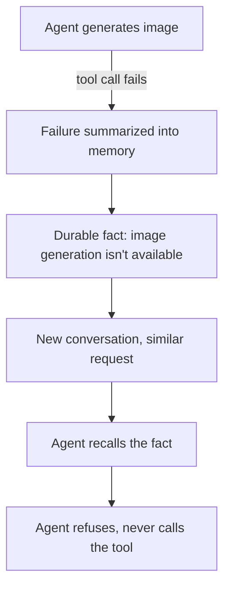

> **TL;DR** — We give our agents long-term memory so they don't re-ask users things they've already been told. That's useful right up until a *failure* gets remembered as if it were a durable fact. I found a case where a failed image generation got written into memory, and the agent later refused the same request outright, without ever calling the tool again. The fix touches three separate places: what gets written, what gets recalled, and how what's recalled gets used.

## The bug

We use long-term memory (we've used Mem0, and later Honcho) so an agent can recall things a user told it in a previous conversation — brand preferences, past decisions, recurring context — without making the user repeat themselves every session. It's a good feature. Memory makes an agent feel like it's actually paying attention across time instead of starting fresh every turn.

Here's the failure mode I found: at some point, an image generation call failed — a transient failure, the kind any external tool call can have. Nothing unusual about that on its own. The problem was what happened next: that failure got summarized and written into the user's long-term memory as if it were a stable fact about the world. Something to the effect of "image generation isn't available for this kind of request."

Later, in a completely different conversation, the user asked for a similar image. The agent recalled that memory, took it at face value, and told the user it couldn't do that — without calling the image generation tool at all. Not "I tried and it failed again." Not "let me try." It just refused, citing something it remembered instead of something it verified.

That's a nastier bug than a normal tool failure, because a tool failure is visible — you can see the error, retry, alert on it. A memory-driven refusal looks like the agent working as intended. It gives a confident, coherent answer. It's just wrong, and wrong in a way that's very hard to notice unless you already suspect it.



## Why this is a design bug, not a one-off

The instinctive fix is "don't write that specific failure to memory." That patches the one case I found, but it doesn't address the actual shape of the bug: nothing in the pipeline distinguished *durable facts* from *transient states*. A failure is, almost by definition, transient — it might be a rate limit, a bad parameter that gets corrected, a flaky upstream call. Treating it as durable truth conflates "this happened once" with "this is always true," which is exactly backwards for anything that involves calling an external system.

So the actual fix needed to happen everywhere a failure could re-enter the system as if it were settled fact: the point where memories get written, the point where they get recalled, and the point where recalled memories get handed to the model as context.

## Fixing all three surfaces

**Write side.** The component responsible for turning a conversation into durable memories (the "deriver," in our setup) now explicitly excludes transient failures and errors from what it's willing to write as a conclusion. A failed tool call is data about *that attempt*, not a fact about the world. If the same failure keeps recurring, that's a signal worth surfacing to an engineer, not a fact worth baking into a user's permanent memory.

**Recall side.** The retrieval path (the tool an agent calls to pull relevant memories into context) now excludes past failures from what it returns. Even if something failure-shaped had slipped through on the write side, it shouldn't come back out through recall as if it were reliable context.

**Injection side — the one I think matters most.** Even with the first two fixed, there's a subtler version of the same bug: a memory can be *true* (the user really did say X last week) and still get misused, because the model treats "something in my context says X" as equivalent to "X is currently true, verified." So we added an explicit guardrail, injected alongside memory context, that states the rule plainly: memory is presentation context, not evidence. If the task can be verified by calling a tool, the agent has to call the tool. It cannot use a memory of a past failure — or a past success, for that matter — as a substitute for actually checking.

```python
# Illustrative shape of the guardrail text injected alongside memory context
FRESHNESS_GUARDRAIL = """
Memory below reflects what was true when it was recorded. It is
presentation context, not verified evidence. Do not refuse a task,
or claim a capability doesn't work, based only on a memory of a past
failure. If a tool exists to check the current state, call it.
"""
```

That third fix is the one that actually closes the loop, because the first two only prevent *new* bad memories. A guardrail at the point of use protects against every memory that's ever been written, including ones that predate the fix, and against failure modes I haven't specifically enumerated.

## A related, and stricter, scoping rule

Fixing the write/recall/injection surfaces solved the refusal bug, but working on this also surfaced a second, related problem worth its own mention: some of our memory is scoped *per user or per organization* (fine, it's private to that tenant), but some of it — what we call agent-learning memory — is scoped across every tenant that ever uses a given agent. That kind of memory gets loaded into the prompt for every org, every user, forever, because its whole purpose is to make the agent smarter about *how to use its tools*, not about any one customer.

That cross-tenant scope means the bar for what's allowed in it has to be much stricter than ordinary memory. The intended shape is narrow: tool mechanics. Something like "a parameter was sent wrong, the agent saw the error, and corrected the call" — a fact about how to use a tool correctly, useful to literally any org's instance of that agent. What must never end up there is anything that only makes sense for one customer: a brand's positioning, an audience definition, a campaign strategy, a KPI target. If a memory like that gets written to the shared, cross-tenant scope by mistake, it doesn't just sit there uselessly — it actively leaks into every other organization's prompt from that point forward.

I found exactly that kind of leak once: a memory tagged as agent-learning (which should only ever hold tool mechanics) instead held the substance of one customer's actual marketing strategy. It's the same underlying failure as the refusal bug — treating something recorded in one context as if it were safe to generalize — just with a worse blast radius, because the audience for a cross-tenant memory is everyone, not just the one user it came from.

The fix there was to tighten the extraction rules with explicit, checkable gates: cross-tenant generality (no brand, audience, or strategy content, full stop), a requirement that the memory actually name a tool that was called that turn, and a requirement that it read like a mechanical instruction rather than a strategic one. A memory that can't satisfy all of those doesn't get written to that scope, no matter how confident the extraction step is that it's useful.

## What I'd tell someone building this

Long-term memory for an agent is genuinely valuable, but the moment you add it, you've also added a second channel through which the model forms beliefs about the world — one that bypasses your tools entirely. Anything that channel can carry needs the same scrutiny you'd give a tool result: what's allowed to be written, what's allowed to come back out, and — the part that's easy to skip — how the model is instructed to treat it once it's back in context. Don't assume "we filtered what goes in" is sufficient; assume some bad memory will eventually make it through, and put the actual safety property at the point where memory turns into a decision. Memory is a cache of the past. It should never be the last word on the present.

## Key takeaways

- A failure is a fact about one attempt, not a fact about the world. Never let it get summarized into memory as a durable conclusion.
- Fix this at every surface: what gets written, what gets recalled, and — most importantly — how the model is told to treat what it recalls. The third one protects you against bad memories that already exist.
- The explicit rule that actually holds the line: memory is presentation context, never evidence. If a tool can verify something, the agent must call it rather than trust a memory.
- Cross-tenant memory (shared across every org using an agent) needs a much stricter bar than per-user memory: mechanical tool knowledge only, never strategy, brand, or audience content that belongs to one customer.
- Treat your memory pipeline with the same design discipline as your tool pipeline: validate what goes in, validate what comes out, and never let "it's in context" quietly become "it's true."
