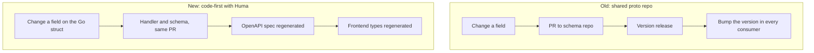

> **TL;DR** — Strique already runs a protobuf schema repo, published per language, for its API contracts. It works, but it makes a one-field change expensive: a schema PR, a release, a version bump in every consumer. For a new Go service, I chose code-first OpenAPI with Huma instead — the contract lives in the same PR as the handler — and paired it with a handful of decisions (GORM auto-migration, UUIDv7 upserts, typed-plus-raw storage for connector data) aimed at the same underlying goal: optimize for how often things change.

## The cost we were already paying

Before this project, our API contracts across services went through a dedicated protobuf schema repository, published as a versioned package per consuming language. That's a legitimate pattern, and it's not the one I'm arguing against in general. What I'm arguing against is using it for a fast-moving, still-shifting API. Changing a single field meant: open a PR against the schema repo, get it reviewed, cut a release, then go update the version pin in every service that consumes it, and only then actually use the new field. For a service under active development, where the shape of the data is still being figured out as real data (real webhook payloads, real product catalogs) comes in, that overhead isn't a minor tax. It's a drag on the exact iteration speed you need most during that phase.

I'd lived with that cost on other services already. When it came time to build the API layer for our new Go-based customer data platform, I made a different call.

## Code-first, the way FastAPI already does it for us

Our Python services use FastAPI, which generates its OpenAPI spec directly from the code: route decorators and typed request/response models produce the schema, rather than the schema being written by hand and the code being made to match it afterward. I wanted the same property for the Go service, and found it in Huma (`danielgtaylor/huma`, v2) — a framework that layers OpenAPI generation on top of Go's standard `net/http`, driven by struct tags and typed handler signatures.

```go
// Illustrative Huma-style handler — not the real service code
type GetOfferingInput struct {
    ID string `path:"id" doc:"Offering ID"`
}

type GetOfferingOutput struct {
    Body struct {
        ID       string `json:"id"`
        Title    string `json:"title"`
        PriceMinor int64 `json:"priceMinor" doc:"Price in the source's minor currency unit"`
    }
}

huma.Register(api, huma.Operation{
    OperationID: "get-offering",
    Method:      http.MethodGet,
    Path:        "/offerings/{id}",
}, func(ctx context.Context, in *GetOfferingInput) (*GetOfferingOutput, error) {
    // handler logic
    return &GetOfferingOutput{}, nil
})
```

The practical difference this makes: adding a field to `GetOfferingOutput` and updating the handler is the entire change. It lands in one PR, reviewed alongside the logic that produces the field, and the OpenAPI spec — which is what the frontend generates its types from — is regenerated from that same source, not maintained by hand in a separate repository on a separate release cadence. There's no version bump to propagate, because there's no separately-versioned package in the loop at all. The contract's lifecycle is the same as the handler's lifecycle.



This isn't a universal argument against protobuf or against a shared schema repo — for a stable contract shared across many independent services at a mature company, the version discipline that approach forces can be exactly what you want. It's a call about fit: this service's contract was still finding its shape, primarily served one frontend, and needed to move faster than a cross-repo release cycle allows.

## Companion decisions, same underlying instinct

Building the API layer forced a few adjacent decisions about how the rest of the platform should store and shape its data — and the thread connecting all of them is the same one: optimize for how the system actually changes over time, not for how tidy a single snapshot looks.

**Tables come from Go structs, not SQL files.** Rather than hand-written or numbered migration files, the schema is defined as GORM structs and applied automatically on startup — the same shape as Spring's `ddl-auto=update` on our Java services, or SQLAlchemy's `create_all` on the Python side. Adding a column is a struct field plus a deploy, not a migration file to write, order, and coordinate with everyone else touching the same migration sequence.

```go
// Illustrative GORM model — not the real schema
type Offering struct {
    ID        string    `gorm:"column:id;type:uuid;primaryKey"`
    StoreID   string    `gorm:"column:store_id;type:uuid;not null"`
    Title     string    `gorm:"column:title;type:text;not null"`
    CreatedAt time.Time `gorm:"column:created_at;type:timestamptz;not null"`
}
```

**IDs are UUIDv7, and upserts target the natural key.** Time-ordered IDs keep inserts at the growing edge of an index instead of scattering writes across it, which matters once a table is under steady write load. The part that actually matters for correctness, though, is where upserts point: at the row's natural business key (a webhook's external item ID, say), never at the freshly generated row ID. If a webhook gets redelivered — which every webhook-based integration eventually has to handle — an upsert on the natural key updates the existing row; an upsert on a newly minted ID would just insert a duplicate every single time.

**Every extra field a connector sends gets stored, typed, and made filterable — never dropped, never squeezed into a column it doesn't fit.** This platform has to work for whichever commerce and ad connectors we add next, not just the ones we've integrated so far, and different connectors send meaningfully different shapes of data. The design that holds up: real columns for the concepts every connector has in common (a title, a price, a status), a typed side table for everything connector-specific (so it's still queryable and filterable, just not a first-class column), and a raw-payload table underneath both, so nothing is ever truly lost even if today's typed model doesn't have a slot for it yet.

**Money stays in the source's own minor currency unit, and the API says so.** A price coming from a connector stays exactly as that connector represents it internally, rather than getting normalized into a display-friendly major unit somewhere in the pipeline. That's a deliberate choice to avoid a subtle class of bug: normalizing early means every downstream consumer has to trust that the normalization happened correctly and consistently, forever. Keeping the raw representation and labeling it clearly (a `doc` tag on the field, which flows straight into the generated OpenAPI spec) pushes the interpretation decision to exactly one place: whoever renders the value for a human.

## A real test case: a connector that doesn't behave like the last one

That connector-agnostic design got tested almost immediately by a real integration that didn't match the shape of the one we'd already built against. Where one commerce platform sends a full product, sizes and prices included, in a single webhook, another platform splits the same information across two separate webhook types — one for the product itself, a second for its sizes and pricing, arriving independently and in no guaranteed order.

Handling that cleanly meant two separate handlers that each write a *partial* record — one fills in product-level fields, the other fills in variant-level fields — without either one clobbering data the other already wrote. It's the kind of requirement that would have been awkward to retrofit onto a schema designed around "a product arrives as one complete document," and straightforward against a schema that was already built assuming connectors won't agree with each other on how data arrives.

## The takeaway

None of these decisions are exotic on their own — code-first API generation, ORM-driven schema, time-ordered IDs, typed-plus-raw storage are all reasonably well-established patterns individually. What ties them together is a single question I kept asking at each decision point: how often is this going to change, and what does the process cost each time it does? A shared proto repo optimizes for contract stability at the cost of change velocity. For a service still finding its shape, I wanted the opposite trade, and it's held up so far against real, messy, non-uniform connector data — which is exactly the kind of pressure that would have found the cracks in a more rigid design early.

## Key takeaways

- Optimize an API contract's tooling for how often the contract changes, not for how elegant a fixed snapshot of it looks.
- Code-first OpenAPI (Huma in Go, mirroring what FastAPI already does in Python) keeps the contract and the handler in the same PR and the same review, instead of a separate repo on a separate release cycle.
- Let your ORM own schema application (GORM auto-migration, Hibernate `ddl-auto`, SQLAlchemy `create_all`) when you want "add a field, deploy" instead of "write and sequence a migration file."
- Use time-ordered IDs for insert locality, but make upserts target the natural business key, not the generated ID — otherwise a redelivered webhook silently becomes a duplicate row instead of an update.
- Design storage for the connectors you haven't integrated yet: typed columns for what's universal, a typed side table for what's connector-specific, and a raw payload underneath both so nothing is ever silently dropped.
- Don't assume the next integration will behave like the last one. A schema built for "data arrives as one clean unit" breaks the moment a connector sends the same entity across two independent events.
