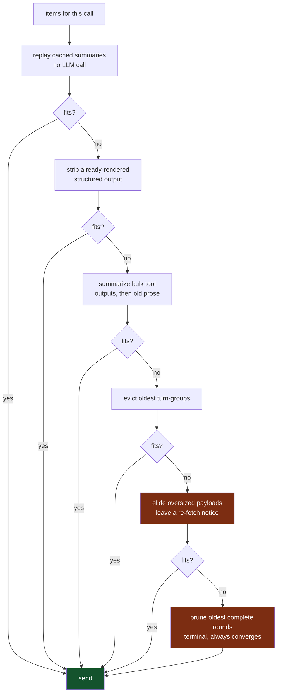

> **TL;DR** — Sub-agents pulling large analytics payloads were blowing past our context window within a run, even though we already compacted history between turns. The cause: the OpenAI Agents SDK reads session history exactly once, at run start; everything after that is rebuilt from the runner's own in-memory list, invisible to any compaction happening on the session side. The fix is a gate hooked into the SDK's one per-call filter, running escalating compaction on the view sent to the model, before every single call, never touching the underlying data.

## The symptom

A sub-agent in our AI marketing platform pulls data through tool calls, analytics rows, campaign details, whatever the task needs, and keeps working across several turns within a single run. On tasks that touch a lot of data, a handful of turns was enough to cross our 400K-token context window. The provider doesn't degrade gracefully when that happens; it rejects the request outright, mid-stream, and the whole turn is lost.

The frustrating part was that we already had compaction. We had a session layer that summarizes conversation history as it grows. It just wasn't helping, on this specific failure, at all.

## Why the obvious fix failed

The instinct is: if history compaction exists and the window still overflows, compact harder, or compact more often. I spent a while there before realizing the actual problem wasn't the compaction's aggressiveness, it was *timing*.

The OpenAI Agents SDK reads `session.get_items()` exactly once, at the very start of a run. Everything the model sees after that point is rebuilt from the runner's own in-memory list, the run-start snapshot plus whatever tool calls and outputs that specific run has generated since. Calling `session.add_items()` mid-run is persistence only, it writes to storage for *next* time. It does nothing to what the current, in-flight run sends to the model on its next call.

```mermaid
flowchart LR
    A["Runner.run_streamed"] --> B["session.get_items&#40;&#41;<br/>ONCE, at run start"]
    B --> C["runner's in-memory list"]
    C --> D{"model call 1"}
    D --> E["+ tool output"]
    E --> F{"model call 2"}
    F --> G["+ tool output"]
    G --> H{"model call N"}
    H -.->|"grows unbounded"| X["input exceeds<br/>the context window"]
    style X fill:#7f1d1d,color:#fff
```



So session-side compaction, no matter how good, can only ever help the *next* run. A run already in progress accumulates raw tool output with nothing enforcing any ceiling on it, right up until the provider says no. That's the actual root cause: not insufficient compaction, but compaction running at a point in the lifecycle the in-flight run structurally cannot see.

## The fix: a gate on the one hook that runs every time

The SDK does expose one hook that fires before every single model call within a run, not once at the start: `call_model_input_filter` on the run config. Whatever that hook returns is what actually gets sent. That's the only lever available that's positioned correctly, so that's what I built against: a `ContextGate` that hooks this filter and compacts the *view* handed to the model, from scratch, on every call, in escalating stages until it fits.

```python
# Simplified shape of the hook
class ContextGate:
    def __call__(self, call_data):
        items = call_data.model_input  # the full raw list, every call
        for stage in self.stages:
            items = stage(items)
            if self.fits(items):
                return items
        return items  # last resort: smallest we could get it to
```

The critical design detail is "the full raw list, every call." The gate is handed everything again each time, not a delta, so it has to be cheap to re-run and it has to converge deterministically, or it becomes its own latency problem on a run with many turns.

## The ladder

Compaction runs as an escalating series of stages, cheapest and least destructive first, stopping the moment the result fits:



Most calls never get past the first stage or two. The later stages exist for the runs that generate enough in a single pass, several large tool outputs plus heavy reasoning, that nothing short of removing whole rounds gets them under the ceiling. That last stage is deliberately terminal: it removes complete rounds, reasoning plus the call plus the output together, oldest first, which is the only way to reclaim tokens from a reasoning block without orphaning the tool call it belongs to.

## The guarantees, and how each is actually enforced

None of this is worth building if it can silently corrupt a conversation or take down a run that would otherwise have succeeded, so every stage answers to a short list of guarantees.

**Never destructive.** The gate only ever transforms the list it's about to hand to the model. The session keeps every item, and the database keeps every raw tool output, forever. Nothing this gate does removes anything from where it's actually stored; it only changes what's in front of the model on this one call.

**Summarize before removing.** Content doesn't disappear from the model's view without its meaning being captured first, either as a summary or because the underlying data still lives somewhere fetchable. The one deliberate exception is the terminal stage, where the only remaining choices are to shrink a pinned payload down to a pointer, or let the provider hard-reject the whole call. A guaranteed failure isn't a real alternative, so the gate elides instead, and it says so explicitly.

**Never fatal.** The SDK re-raises whatever a hook throws, and a raised exception here kills the entire run. So every failure path in the gate, a bug in a stage, a timeout talking to a summarizer, anything, is caught and falls back to the original, unmodified input. Worst case, the gate did nothing this call and you're exactly where you'd be without it. It should never make things worse than not having a gate at all.

**Idempotent.** The gate gets the same full raw list again on the next call, not a diff. Summaries are cached by the tool call's id, so the same content gets summarized once and replayed deterministically after that, one real LLM call per batch of content, not one per model call in the run.

**Pairing-safe.** A tool call is never separated from its own output. Anything that would orphan one side of that pair is rejected at that stage, because an unpaired call or output is an automatic hard error from the provider, a worse failure than the one the gate exists to prevent.

**Policy-safe.** Certain content is never eligible for summarization at all: grounding ids, asset URLs, human-in-the-loop answers, anything a side-effecting tool returned. Summarizing an id is how you get a sub-agent to mint a second campaign because it lost track of the first one's id.

## The honest trade-off

The terminal stage elides pinned payloads it can't shrink any other way, replacing them with an explicit notice naming the tool that can fetch the real content back. That's a real trade, not a free lunch: the model temporarily loses direct access to something it might need, in exchange for the call actually going through. The only alternative on the table was a guaranteed provider error that loses the entire turn, work included. Given that choice, a recoverable pointer beats a hard failure every time, but it's worth saying plainly rather than pretending the gate makes the window infinite. It doesn't. It makes running out of it survivable instead of fatal.

## What I'd tell someone building the same thing

Before you tune a compaction algorithm, go find out exactly when your framework reads the state you're trying to compact. I spent real time trying to make our existing compaction "better" before realizing the actual bug was that it ran at the wrong point in the run's lifecycle, invisible to the very call it was supposed to be protecting. Compaction that runs at the wrong time doesn't help the run in progress no matter how good it is; it only helps whatever runs next. Find the one hook, if your framework has one, that actually sits on the critical path of every call, and put your ceiling there.

## Key takeaways

- Know exactly when your agent framework reads conversation state, not just that it reads it. A session-level fix that runs at the wrong point in the lifecycle can be invisible to the exact call it's meant to protect.
- If your framework exposes a per-call hook, that's where a hard ceiling belongs, not in the session layer, if the session layer is only consulted once per run.
- Escalate compaction in stages, cheapest and least destructive first, and stop the moment the result fits. Most calls should never need the expensive stages.
- Summarize before you remove, except at a deliberate, clearly-labeled backstop where the only other option is a guaranteed failure.
- A compaction hook must be idempotent and must never be allowed to fail the run it's protecting. If it errors, fall back to the unmodified input, not to a crash.
