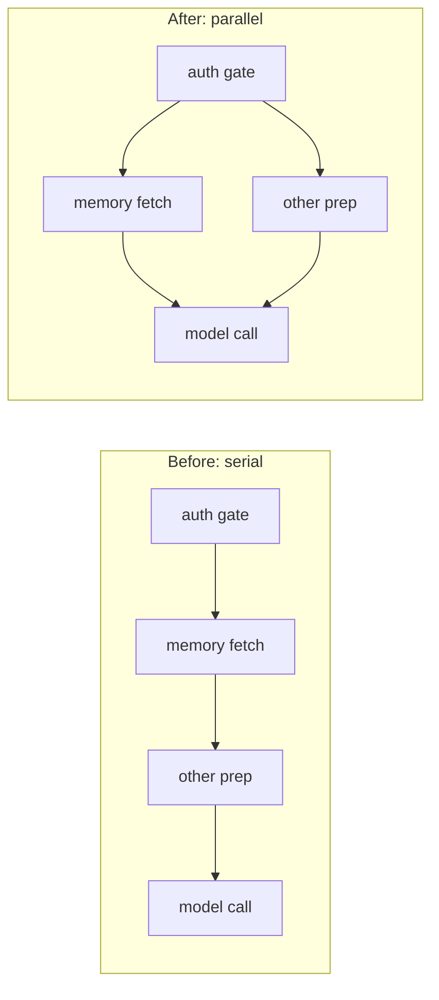

> **TL;DR** — The worst case for time-to-first-token on a brand-new conversation ran into several minutes, and it had nothing to do with the model being slow to think. A live trace of a fresh "hello" broke the ~22 seconds it usually took into five pieces, and most of them were blocking work that never needed to sit in front of the first token at all. Fixing the actual bottlenecks, not the LLM call, is what got it down.

## The symptom

Users would start a brand-new conversation in our AI marketing platform, type something as simple as "hello," and then wait. Not the acceptable kind of wait where a spinner tells you something's happening and it resolves in a couple of seconds. The bad kind, where the worst cases stretched into several minutes before a single token of the response showed up. For a one-word greeting, that's not a performance problem, it's a trust problem: the product looks broken.

Two constraints made this harder than "just make it faster." I wasn't willing to trade context for speed, and I wasn't willing to risk overflowing the model's window to save time either. Whatever fix I made had to leave every context guarantee intact and just remove the blocking work that didn't need to be there.

## Measure first

Before touching anything, I traced a real, fresh conversation end to end and looked at where the ~22 seconds it typically took actually went. Guessing at latency problems is how you end up optimizing the wrong thing confidently. The trace broke down into five pieces:

- **4 seconds** of serial frontend round-trips before the request even reached our backend
- **4.7 seconds** fetching from the memory service
- **4 seconds** of serial database reads
- **8 seconds** of actual time-to-first-token from the model itself
- **5.7 seconds** rewriting the model's reasoning output into something safe to show the user


Only one of those five numbers is the model actually generating a response. The other four are entirely our own plumbing, running in front of the model, serially, on every single fresh conversation. That's the number that mattered: more than half the trace was work we controlled and hadn't needed to put on the critical path in the first place.

## Root cause 1: a timeout default nobody had looked at

The memory-service fetch was the single biggest lever, and also the scariest one in the worst-case traces, because its numbers weren't consistently 4.7 seconds, they'd occasionally balloon far past that. Digging into why turned up a default nobody had actually chosen: the memory service's SDK defaulted to a 60-second transport timeout, times three retries. On a slow or degraded response from that service, a single fetch could legitimately sit for minutes before giving up, and that fetch was awaited, blocking, before anything else could happen.

The fix was to stop trusting the SDK's defaults and set explicit transport timeouts, plus an application-level cap on the fetch itself. I set that cap at 5 seconds, deliberately, at roughly twice the measured p50 for that fetch, which sat around 2.5 seconds. I'd initially reached for a rounder, unmeasured number, 3 seconds, and rejected it specifically because it wasn't backed by anything I'd actually measured. A timeout you pick from a trace beats a timeout you pick because it sounded reasonable.

```python
# Simplified: don't inherit an SDK's default transport timeout blind
memory_client = MemoryClient(timeout=HONCHO_TIMEOUT_SECONDS)  # explicit, not library default

async def fetch_memory_context(user_id: str):
    try:
        return await asyncio.wait_for(
            memory_client.fetch(user_id),
            timeout=MEMORY_FETCH_CAP_SECONDS,  # 2x measured p50, not a guess
        )
    except asyncio.TimeoutError:
        return None  # degrade gracefully, don't block the turn on it
```

## Root cause 2: work that didn't need to be serial

Even with the timeout fixed, the memory fetch was still sitting fully in front of everything else, awaited, before the request moved on to its next step. But nothing about that fetch actually depended on the steps after it, or the steps after it depended on it. It could run *alongside* other preparation work instead of before it. The fix was to kick the memory fetch off right after the request cleared the auth gate, in parallel with the rest of turn preparation, and only await its result at the point it was actually needed, not the point it was requested.



This is the same lesson twice: not every step that happens before the model call needs to happen *serially* before it. Some of it is genuinely a dependency. A lot of it, once you actually trace it, just happened to be written that way.

## Root cause 3, 4, 5: smaller cuts that added up

A few more blocking waits came out of the same trace-driven pass:

- **The compaction lock wait dropped from 30 seconds to 3.** If a compaction pass from a previous turn was still holding the lock, the old code waited up to 30 seconds for it to release before doing anything else. Now it waits 3 seconds, and if the lock is still held, it falls back to reading a consistent snapshot straight from the database instead of waiting on the lock at all.
- **Brand-new conversations get their empty-history cache pre-seeded.** A conversation's very first message used to pay for two database round-trips just to discover there was no prior history to load. Seeding that cache the moment the conversation is created saves those round-trips on the first message, worth about 1.8 seconds on that trace.
- **The reasoning rewrite got a hard cap and moved to a fast model.** Turning a model's raw reasoning trace into something safe to show the user is itself an LLM call, and it was sometimes the slowest single piece of the whole request. It's now capped at 5 seconds and always runs on a fast, lightweight model regardless of which provider is serving the main answer, so it can't become the tail latency on an otherwise fast turn.

None of these individually was the whole problem. Stacked together, serially, on every fresh conversation, they were most of the several minutes in the worst case.

## What I'd tell someone building the same thing

Trace before you tune. I could have spent a long time trying to make the model faster, upgrading models, tweaking prompts, and it would have been the wrong lever, because the model was never the majority of the time in the worst cases. The actual fix was almost entirely about finding blocking work that didn't need to be blocking, serial work that didn't need to be serial, and a timeout default that nobody had consciously set. None of that shows up if you start from "the LLM is slow." It only shows up if you trace an actual request end to end and look, honestly, at where the seconds went.

And when you do find a number to tune, like a timeout, ground it in something measured. An unmeasured guess that happens to work today is a latency regression waiting for the day the underlying service's behavior drifts.

## Key takeaways

- Trace a real request end to end before optimizing. Assuming the LLM call is your bottleneck, without measuring, wastes effort on the wrong fix.
- Audit every SDK's default timeouts explicitly. A default retry-and-timeout policy tuned for someone else's use case can turn a degraded dependency into a multi-minute stall on your critical path.
- Ask whether each step genuinely depends on the step before it, or whether it only happens to be written serially. Independent work should run in parallel, awaited only where it's actually needed.
- Set timeouts from measured percentiles, not round numbers that feel safe. A 2x-p50 cap beats an unmeasured guess even when the guess happens to work today.
- Small, unglamorous fixes, a lock wait, a pre-seeded cache, a capped auxiliary LLM call, can outweigh the model's own latency when you stack up everything that runs in front of it.
