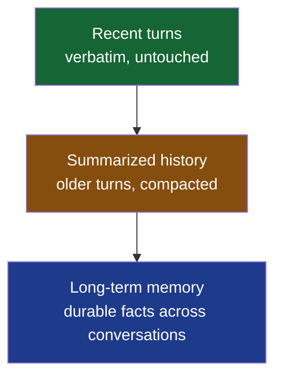
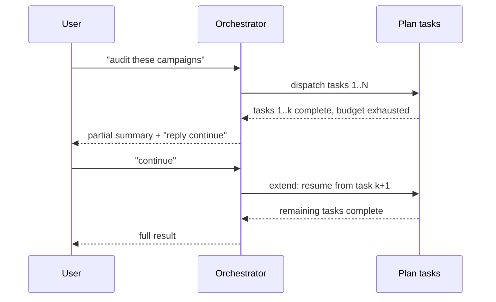
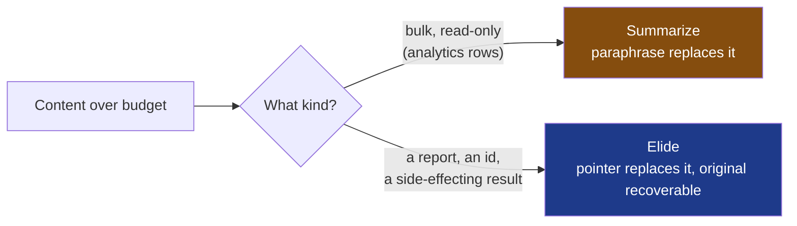

> **TL;DR** — We treat context as tiers, not one flat history: recent turns, summarized older history, and long-term memory, with compaction running in the background between turns rather than blocking the user. Sub-agents get an allowlisted seed, not the whole conversation. And side-effecting results get elided with a pointer back to the original, never paraphrased, because a paraphrased number is a wrong number.

## The problem with one flat history

The naive way to keep an agent conversation within a context window is: when it gets too long, summarize the oldest half and keep going. That works exactly once. Run it on a conversation that keeps growing, with an agent that keeps calling tools and generating output, and you're back over budget within a few more turns, summarizing your own summaries, and the plot of what actually happened starts to blur.

The fix isn't a smarter single pass. It's treating context as layers with different jobs, and being disciplined about which layer does what.



Recent turns stay exactly as they happened, because an agent reasoning about "what did the user just ask" needs the actual words, not someone's paraphrase of them. Older turns get folded into summaries once they're no longer the active thread. Long-term memory sits outside any single conversation entirely, it's the durable stuff worth carrying across sessions, not the blow-by-blow of how we got here today.

## Compaction runs after the turn, not during it

The other design choice that mattered as much as the tiering itself: compaction doesn't sit on the path between the user's message and the model's answer. It runs in the background, after a turn completes, so a slow summarization pass never adds latency the user has to sit through. The user sees their answer the moment it's ready; the bookkeeping that keeps the next turn's context small happens after, off to the side.

That only works if you're honest about what's safe to lose if the background pass never finishes, a crash, a timeout, whatever. The answer is: nothing critical, because the next turn simply re-evaluates whether compaction is needed and tries again. Nothing about correctness depends on a background compaction pass succeeding on any particular attempt.

## Plan recovery: resuming instead of restarting

Long-running work in an agent system isn't always a single turn. A multi-step plan, several tasks dispatched to specialist sub-agents, can get interrupted mid-way: the agent runs out of its step budget for that turn, or the process needs to move on before every task finishes. The naive response is to throw away whatever was in progress and restart the whole plan next time. That's wasteful and, worse, it's user-hostile: work that already finished gets redone, and the user has to wait through it twice.

Instead, a plan that gets interrupted resumes through an explicit extend step rather than a fresh start. What's already done stays done. The next turn picks up the plan where it left off, continuing the remaining tasks instead of re-running the ones that already reported a result.



The mechanism that makes this safe is the same one that makes compaction safe: nothing about resuming re-executes a task that already had a real, side-effecting result. A sub-agent that already finished its report keeps that report; extending the plan adds to what's there, it doesn't rewind it.

## Sub-agents get an allowlist, not a denylist

The other place a flat "give it everything" approach breaks down is when the orchestrator dispatches work to specialist sub-agents. My first instinct here was a denylist: seed each sub-agent with the full conversation, minus whatever obviously belonged to a different sub-agent. That sounds reasonable and it's wrong, because "everything else" on a conversation with many dispatched tasks is still most of the conversation. A sub-agent doing one focused task doesn't need to see every other task's raw output to do its own job; it needs its instructions, a handful of grounding facts (which platform it's working against, which account, ids the orchestrator already minted that it needs to avoid creating duplicates of), and nothing else.

So the seed is an allowlist, built from scratch per sub-agent, not the conversation minus some exclusions:

```python
# Simplified shape of what a sub-agent is seeded with
def build_seed(task, orchestrator_context):
    return {
        "task": task.instructions,          # what this agent needs to do
        "user_ask": orchestrator_context.user_messages,
        "grounding": orchestrator_context.entity_ids_for(task),
        "own_prior_report": task.previous_report,  # if this is a retry
        # explicitly NOT included: other tasks' reports, other tasks' tool calls,
        # the orchestrator's own analysis prose
    }
```

This isn't just cheaper, it changes what "compaction" even means for a sub-agent. A denylist-seeded sub-agent on a large multi-task run can end up needing to summarize other agents' finished prose just to fit, which is exactly the situation where summarization stops helping: prose isn't compactable the way a bulk data table is, so you shrink it and lose the meaning anyway. An allowlist-seeded sub-agent never has that problem in the first place, because it was never handed the thing it didn't need.

## Summarizing and eliding are not the same operation

The other distinction that took getting wrong once to really internalize: summarizing and eliding solve different problems, and using the wrong one for a given kind of content produces a different kind of failure.

**Summarizing** replaces content with a paraphrase. That paraphrase is what the model sees from then on; the original is gone from its view. This is the right tool for bulk, read-only data where what matters is the gist, a large table of analytics rows where the aggregate trend matters more than any individual row.

**Eliding** replaces content with a pointer back to where the original still lives, fetchable again on demand. Nothing about the content is paraphrased; it's just not in the immediate view right now.

The distinction matters most for a sub-agent's finished report, or anything a side-effecting tool produced. A report is the deliverable: specific metrics, specific ids the agent minted, specific per-platform findings. Summarizing that is lossy in a way that compounds, because a paraphrased number isn't approximately the number, it's a different, wrong number sitting where a real one used to be, and nothing downstream can tell the difference. Eliding a report costs nothing but a re-fetch if it's needed again, because the real bytes are still sitting exactly where they were, recoverable in full.



Getting this backwards, summarizing something that should have been elided, doesn't fail loudly. It fails quietly: the model answers confidently with a number that used to be right.

## How this pairs with the per-call gate

Everything above is the layer that runs between turns: deciding what a fresh model call should even be seeded with, deciding what's safe to compact once a turn is done. It's a necessary layer, but it isn't sufficient by itself, because a single turn can still balloon while it's in progress, well after the between-turns layer already did its job for that turn. That's a separate problem with a separate fix, a gate that runs before every individual model call within a run, not just between turns. That's its own story.

## What I'd tell someone building the same thing

Don't reach for one compaction pass and assume it scales by running it more often. Decide up front which tiers your context actually has, recent, summarized, long-term, and give each one a distinct job instead of one function that tries to do all three. And before you write a summarizer, ask whether the content in front of it is something you can afford to paraphrase, or something where a pointer back to the original is the only honest option. Those are different problems wearing the same "context got too big" costume.

## Key takeaways

- Treat context as tiers with distinct jobs (recent, summarized, long-term), not one history you periodically shrink.
- Run compaction in the background after a turn, not inline before the answer; make sure nothing correctness-critical depends on any single background pass succeeding.
- An interrupted multi-step plan should resume from where it left off, not restart. Preserve completed work explicitly rather than re-deriving it.
- Seed sub-agents with an allowlist built for their specific task, not the full conversation minus exclusions. It's cheaper and it sidesteps a whole category of unsummarizable content.
- Summarizing and eliding are different tools. Summarize bulk, read-only data you can afford to paraphrase. Elide anything where the exact original matters, reports, ids, side-effecting results, and give the model a way to fetch it back.
