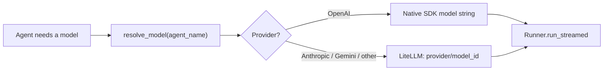
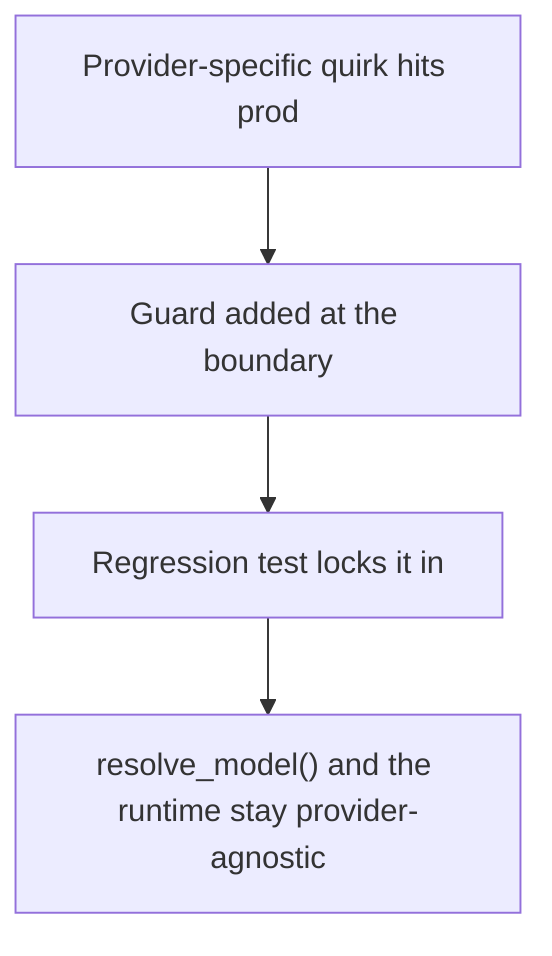

> **TL;DR** — I put every model call in our agent runtime behind a single `resolve_model()` switch backed by a YAML registry, with LiteLLM carrying the non-OpenAI providers. That got us provider choice per agent without forking the runtime. The hard part wasn't the routing, it was five small, provider-specific lies each SDK tells about itself, each of which needed its own guard.

## Why I did it

Our AI marketing platform runs on the OpenAI Agents SDK: multi-agent orchestration, tool execution, streaming, all of it. When we started, every agent used one OpenAI model. That's a fine starting point and a bad long-term bet. Being pinned to a single vendor means every price change, every rate limit, every model deprecation is a forced migration, and it means every agent uses the same model regardless of whether the task in front of it needs deep reasoning or just needs to call a tool and format a response.

So the goal was: pick a model per agent, by cost and by the quality that task actually needs, and don't get locked into any one vendor's roadmap. That's it as a business goal. As an engineering problem, it's "how do you support N providers without N codepaths."

## Design: a registry and one switch

The shape I landed on is boring by design, which is the point. A YAML file is the model registry: it lists which models exist, which provider each belongs to, and which agents in the system use which model. Every place in the codebase that used to hardcode a model string now calls a single function, `resolve_model()`, and gets back whatever the registry says for that agent.

```python
# Simplified shape of the registry-backed resolver
def resolve_model(agent_name: str) -> str:
    entry = MODEL_REGISTRY[agent_name]
    if entry.provider == "openai":
        return entry.model_id  # passed straight to the SDK
    # every non-OpenAI provider is carried by LiteLLM
    return f"litellm/{entry.provider}/{entry.model_id}"
```

That one indirection is what makes "add a provider" or "move this agent to a cheaper model" a registry edit instead of a code change. OpenAI models go straight to the SDK, because the SDK is native to OpenAI's API shape. Every other provider (Anthropic, Gemini, and the rest) goes through LiteLLM, which normalizes each vendor's chat-completions dialect into something the SDK's streaming and tool-calling machinery can consume without knowing it isn't talking to OpenAI.



The registry currently lists 61 models across 9 providers, OpenAI, Anthropic, Gemini, xAI, DeepSeek, GLM and others, and every agent's model assignment routes through the same switch. No agent code branches on "which provider am I running on." That branching, when it's genuinely needed, lives in exactly one place.

## The part that actually took the time

Routing the model call was the easy 20%. The other 80% was that the Agents SDK was built and tested against OpenAI's Responses API, and every other provider, speaking chat-completions through LiteLLM, disagrees with it about small things that turn into hard crashes if you don't catch them. None of these showed up in design review. Every one of them showed up as a production bug, then became a guard, then became a test.

**Fake IDs collided as real primary keys.** On the chat-completions path, the SDK stamps a placeholder ID, literally a fixed placeholder string, onto both the response object and every output item: reasoning blocks, messages, tool calls. On OpenAI's own Responses API these come back as real unique IDs. We persist those IDs as primary keys, so the very first time two turns both got the same placeholder, we hit primary-key collisions across turns and conversations. The fix was to mint real IDs at the edge: the moment the runtime sees the placeholder on an incoming event, it generates a real one and uses that from then on, before anything touches the database.

```python
# Simplified: replace a provider's placeholder ID the moment we see it
FAKE_ID = "__fake_id__"

def normalize_id(raw_id: str) -> str:
    if raw_id == FAKE_ID:
        return f"resp_{uuid7()}"
    return raw_id
```

**Tool outputs changed shape.** Client-side MCP tool results arrive as a list of content parts, not a plain string, on this path. Our persistence layer had a `VARCHAR` column expecting a string, and the first non-OpenAI tool call threw a type error trying to write a Python list into it. The fix was a small coercion step that extracts the text parts, or JSON-encodes the payload if it isn't plain text, before it ever reaches storage.

**A reasoning parameter that used to work stopped working.** Newer Claude models reject the older mapping we used for thinking budgets outright, a hard 400 on any call that tried to set an explicit token budget for reasoning the old way. The fix wasn't to find a new mapping and keep tuning it, it was to stop setting it at all for that provider and let its own adaptive thinking behavior take over. Less configuration, not more, turned out to be the fix.

**Tool names got mangled in transit.** Claude would occasionally call one of our tools by a shortened name, dropping a suffix our naming convention relies on. An unrecognized tool name is a hard crash for the SDK, not a soft failure the model can recover from and retry. Nothing in our prompts told it to do this; it's just a habit the model has around tool naming. The fix was to register a second, bare-named alias for every affected tool, pointing at the same implementation, so both spellings resolve.

**Hosted tool access didn't travel.** Our original MCP tool integration used OpenAI's hosted MCP support, which is specific to the Responses API and simply doesn't exist as a concept on the other providers. We moved everything to client-side MCP: the runtime opens its own connection per run instead of delegating that to the provider. That turned out to be a strict improvement even for OpenAI, since a connection scoped to a single run is also the safer shape for a system serving multiple tenants at once.



## Prompt discipline

The registry solved model selection. It didn't solve prompt drift, which is its own way to end up with N codepaths by accident: three near-identical system prompts that quietly diverge over time because someone tuned wording for one provider and forgot the other two.

The rule I set was that every agent gets exactly one static system prompt, roughly 21.5k tokens, byte-identical no matter which provider is serving that turn. Identical bytes matter for a concrete reason: providers that support prompt caching key on exact prefix matches, so a prompt that's stable and provider-neutral is cacheable, and one that gets a silent per-provider tweak isn't. Anything that legitimately needs to vary turn to turn, current date, per-turn capability notes, goes into a separate message appended just before the user's turn, never folded into the system prompt itself.

## What I'd tell someone building the same thing

Don't expect the hard part to be routing. Routing is a lookup table. The hard part is that every provider SDK, however good, was written and hardened against its own vendor's API first, and the seams show up exactly where you least expect them: primary keys, column types, parameter names that quietly change meaning between model generations. You won't find these in a design doc. You'll find them in production, one at a time, and the only real defense is to fix each one at the boundary where it enters your system, not scattered through business logic, so the fix is a guard plus a test, not a rewrite.

And resist the urge to fork prompts per provider the first time a model behaves oddly. A provider-specific patch is sometimes genuinely necessary, dropping a stale parameter for a newer model generation was, but it should be the exception you can point to and justify, not the default way you handle "this provider is different." Most of what looks like a prompt problem is actually a plumbing problem wearing a prompt-shaped disguise.

## Key takeaways

- Put every model selection behind one function backed by a data file, not scattered model strings. Adding a provider becomes a registry edit, not a code change.
- Treat an adapter library like LiteLLM as a normalizer, not a magic fix. It closes the protocol gap; it doesn't close the behavioral gaps each provider's models have around IDs, parameters and tool-calling habits.
- Every cross-provider bug we hit was a boundary problem: an ID format, a payload shape, a parameter that used to work. Fix each one exactly at the boundary, with a regression test, not with a business-logic special case.
- Keep the system prompt static and byte-identical across providers wherever you can. It's both simpler to reason about and it's what makes prefix caching actually work.
- When a model behaves strangely on one provider, look for the plumbing problem first. A provider-specific prompt fork should be rare and justified, not the default response.
