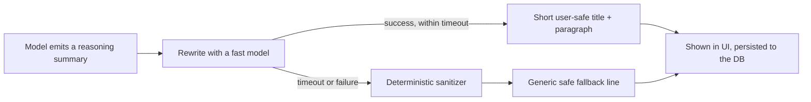

> **TL;DR** — We stream a live "thinking" panel so users can see the agent reason before it answers. That panel was showing raw model reasoning verbatim, and the reasoning itself described internal implementation details — storage paths, UI data structures, approval plumbing — in plain natural language. A keyword-based filter missed almost all of it, because the model never used the keywords we were blocking. The fix was to stop trying to detect leaks and instead rewrite every reasoning summary before it's shown.

## What the panel was supposed to do

Several of the model providers we route through — OpenAI, Anthropic, Gemini — stream a reasoning trace before or alongside the final answer: a rolling account of what the model is "thinking" as it works through a request. We surface a version of that in the UI, a live panel that shows short reasoning snippets while the user waits, mostly to make waiting feel less like waiting. It's a nice UX property. A blank spinner communicates nothing; a panel that says "checking last week's campaign spend" tells the user the agent is actually doing something relevant.

The problem is that "what the model is thinking" isn't the same thing as "what's safe to show a user." A reasoning trace is the model's internal monologue about how it's solving the problem, including the parts of the problem that are about *our system*, not the user's question. And it turns out our system has a lot of internal shape that a model happily narrates out loud if you let it: which storage backend a file went to, the JSON structure a UI component expects, that a particular action is waiting on a human-in-the-loop approval, how a currency value is represented internally, which CDN a media URL is allowed to come from. None of that is secret in a way that matters if an engineer reads it in a log. All of it is exactly the kind of internal detail you don't want casually narrated to an end user in a live chat panel.

## Why the keyword filter didn't work

The first version of this had a defense: before showing a reasoning summary, check it against a list of blocked keywords — words like "schema," "tool," or characters like underscores that tend to show up in internal identifiers. If a chunk of reasoning tripped one of those, it got rewritten before being shown; otherwise it streamed through untouched.

That approach has an assumption baked into it that doesn't hold: it assumes leaks look like internal jargon. They don't, reliably. A model narrating its own reasoning doesn't say "writing to the `gcs_upload` path." It says something like "I'll save this to the cloud storage location for this conversation" — which describes exactly the same internal fact, in ordinary prose, using none of the words on any blocklist you'd think to write. Same for describing a UI's internal JSON shape ("I need to structure this as a set of tabs with a metrics grid inside each one") or an approval step ("I should wait for the user to approve this before continuing" can, depending on phrasing, reveal that there's a distinct internal approval mechanism at all). A keyword filter is pattern-matching on vocabulary. Prose that conveys the same meaning through different words sails straight past it.

Put simply: an allowlist-style keyword filter can catch a leak that happens to use a flagged word. It cannot catch a leak, because a leak is defined by *meaning*, and meaning doesn't require any particular word.

## The fix: rewrite everything, not just what looks risky

Once I accepted that detection-then-filter was the wrong shape, the fix became more obvious, if more expensive: stop trying to decide which reasoning summaries are risky, and rewrite *all* of them, every time, into a short, user-safe title and paragraph using a fast model. The rewrite's job isn't to sanitize dangerous words, it's to re-describe what the agent is doing in terms a user should see — "checking last month's ad spend across your connected accounts" — regardless of what internal detail the original reasoning happened to mention along the way.

Two things make this safe as a default rather than just convenient:

- **The rewrite is the same value used for both the live stream and what gets persisted.** There's no path where the raw reasoning is stored even if the rewritten version is what's shown live — a later "show reasoning history" view can't accidentally surface what the live panel correctly hid.
- **Failure degrades toward silence, not toward the raw text.** If the rewrite call itself fails or times out, the fallback is a generic, deterministic line — something like "Thinking through your request" — never the original unrewritten reasoning. Showing nothing specific is always safer than showing something specific but unvetted. The instinct to "just show the raw text if the safe version isn't ready" is exactly backwards for this kind of leak.

Latency is capped tightly, because a "thinking" panel that itself takes several seconds to update defeats the UX purpose it exists for. If the rewrite doesn't come back inside that budget, a deterministic sanitizer (strip anything that structurally looks like a path, an identifier, or a code fence, trim length) takes over rather than waiting further or falling back to raw text.

One more detail worth naming honestly: this isn't a uniform problem across every model provider we route through. At the time of this fix, one of our providers, Anthropic, didn't stream a live reasoning trace into the panel at all, so the leak surface was specific to the providers that do. That's still worth designing for deliberately rather than assuming every provider behaves the same way: the rewrite path has to be something every provider's reasoning output passes through, not a check bolted onto whichever provider we built against first.

## The trade-off, stated plainly

This costs something: an extra fast-model call for essentially every reasoning chunk that streams, on every turn where the agent reasons at all. That's not free, and it's not zero latency even with a tight cap. I think it's clearly worth it, because the alternative failure mode isn't "slightly worse UX," it's "the chat panel narrates our storage layout to whoever's watching." A confidentiality guarantee is worth a few cheap model calls. What it's not worth is trying to get the same guarantee out of a cheaper mechanism that can't actually provide it — which is the mistake the keyword filter made in the first place.

## What I'd tell someone building the same thing

If you're surfacing any kind of live model reasoning to end users, don't reach for a blocklist as your safety mechanism. A blocklist encodes an assumption that unsafe content looks a specific way lexically, and chain-of-thought reasoning, being free-form natural language, doesn't respect that assumption even slightly. Treat the reasoning trace the same way you'd treat any other untrusted-by-default output: transform it into the shape you actually want to show, don't try to scan the original for danger and let everything else through unchanged. And when the transform itself can fail, make the failure path *more* conservative than the success path, never less — a generic fallback line beats raw internals showing up "just this once" because a timeout fired at the wrong moment.

## Key takeaways

- Model reasoning traces narrate internal system details in ordinary prose, not in the jargon a keyword filter is built to catch.
- A blocklist filters on vocabulary; a leak is defined by meaning. Those aren't the same axis, which is why the filter missed almost everything that mattered.
- Rewrite every reasoning summary unconditionally, rather than trying to detect which ones are risky. Detection-then-filter only works when the risky cases are lexically distinguishable, and here they weren't.
- Make the rewritten value the single source of truth for both the live stream and what gets persisted, so there's no back door where raw reasoning survives in history.
- When the safety transform itself fails or times out, fall back to something generic, never to the original text. Showing nothing specific beats showing something unvetted.
