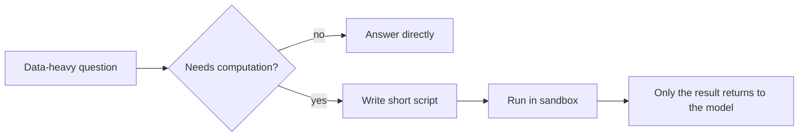
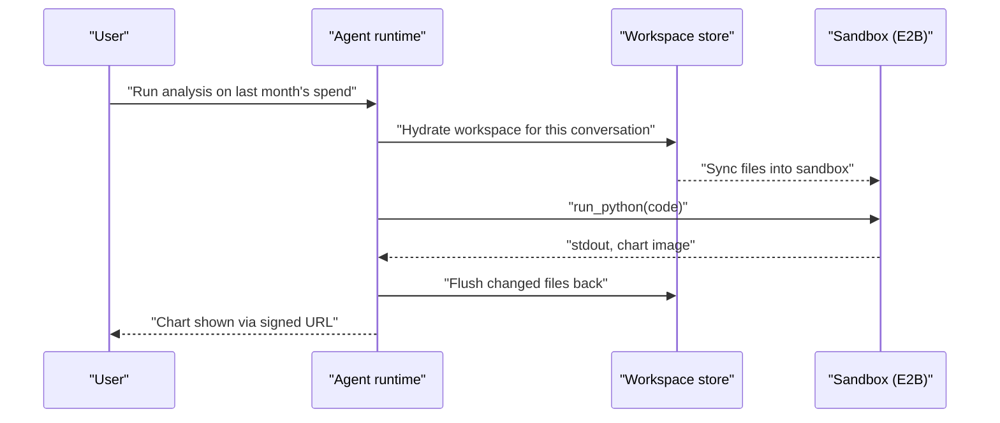

> **TL;DR** — Letting an agent write and execute its own code is a real capability upgrade (it can analyze data instead of dumping JSON into the model's context), but it also means running code an LLM wrote, server-side, on request. I chose E2B's microVM sandboxes over building our own isolation on GKE, built a workspace model that treats the sandbox as disposable and object storage as the source of truth, and hit a couple of real landmines getting there.

## Why an agent needs to run code at all

A lot of what our agents do involves numbers: campaign spend, click-through rates, conversion counts, across a dozen ad and commerce platforms. The naive approach is to fetch that data and hand it to the model as JSON, and let the model do arithmetic and comparisons in its own head. That works until the dataset is large, at which point you're either truncating data the user actually needed, or blowing through the context window just to answer "which of these campaigns underperformed."

The better approach is to let the agent write a short script — pandas, DuckDB, whatever's appropriate — that does the actual computation, and only bring the *result* back into the model's context. Ten lines of code and a filtered dataframe beat four thousand rows of raw JSON, every time. The catch is that "let the agent write a script and run it" means running code an LLM generated, based on a user's prompt, on our infrastructure. That has to be treated as hostile code: it needs isolation from our systems, from other tenants' data, and from any credential it has no business touching.

## The hosting decision

There were really two paths: use a managed sandbox provider, or build isolation ourselves on our existing GKE cluster using gVisor (a user-space kernel that Google itself uses to run untrusted code — even a container "escape" lands inside gVisor's fake kernel, not on the real node).

Both give you real isolation. The difference is what you have to build and operate around that isolation. Self-hosting on GKE meant building a pod lifecycle controller for per-message-scale execution (not the per-site scale we already had experience with), a warm pool to hide cold starts, our own egress allowlisting, and ongoing capacity and abuse monitoring — all before shipping a single sandboxed run. A managed provider like E2B, which runs each sandbox in its own Firecracker microVM (the same technology behind AWS Lambda's isolation), gives you egress control, fast create/resume, and file APIs out of the box.

I estimated the GKE path at several engineer-weeks to reach production quality, plus permanent operational ownership afterward, against a few days to get E2B wired up behind our own adapter interface. For a v1, that gap was decisive. I picked E2B, behind an interface abstract enough that swapping providers later is a backend change, not a rewrite — agents never know which sandbox provider is underneath.



## The architecture: sandbox is disposable, workspace is not

The core design decision, independent of which provider I picked, was to treat the sandbox itself as a disposable compute unit and put the durable state somewhere else entirely. Every conversation gets its own workspace in object storage. When an agent needs to run code, the sandbox is hydrated from that workspace, and anything it produces or changes gets flushed back at the end of the run. If the sandbox provider has an outage, or a session expires, or we switch providers outright, nothing is actually lost — the workspace was always the source of truth, the sandbox was just where the CPU cycles happened.



A few practical decisions fall out of that model:

- **Sandbox sessions are reused per conversation, not recreated per call.** A short-lived pointer to the live sandbox is cached, so a follow-up question in the same conversation resumes an already-warm sandbox instead of paying create latency again.
- **Sync is diff-based with a size cap.** We don't re-upload a whole workspace on every flush; only changed files move, and there's a ceiling on how much any single flush can push, so a script that accidentally generates a huge file doesn't blow up the sync step.
- **Concurrency is capped per organization.** Every org gets a limited number of concurrent sandbox slots, so one tenant running a burst of heavy analysis can't starve everyone else.
- **Stdout is capped and offloaded.** Large console output gets truncated in-line and the full text is written to a file instead, so a runaway `print` loop doesn't blow past the return payload.
- **Chart images come back as signed URLs**, not inline blobs, keeping the response light and letting the frontend fetch the image directly.

One deliberate decision worth calling out: the sandbox tools themselves are invisible on the frontend. No tool card, no raw code, no stdout shown to the user. Only the *outputs* surface — a chart image through the normal media pipeline, other generated files as a download card. The reasoning is straightforward: the code and its console output are implementation detail, not something a marketing user needs or wants to see; what they want is the chart.

## The landmine: a minor version quietly broke us

Live testing turned up a lesson that's easy to forget once a dependency has been stable for a while: a *minor* version bump in the sandbox SDK's underlying transport library removed a keyword argument that the layer above it still depended on. Every code execution started failing with a low-level `TypeError` about an unexpected argument, the kind of error that gives you no hint it's a version mismatch two layers down.

The fix was simple once diagnosed — pin the dependency to a known-good range — but the more important fix was procedural: pin it *with a comment explaining why*, so the next person (including me, in six months) doesn't see an old pin, assume it's stale, and "helpfully" bump it back into the same failure.

```python
# requirements.txt (illustrative)
# e2b core must stay below 2.38: that release dropped a transport kwarg
# that the code-interpreter SDK still passes. Bumping this breaks every
# sandboxed run with a TypeError from deep inside the HTTP layer.
e2b<2.38
e2b-code-interpreter==2.9.0
```

The broader takeaway from that incident: in any system with more than one moving dependency, "it worked yesterday" is not a property you get to assume across an upgrade, even a minor one. Pin what you depend on, and leave a trail for why, especially in a part of the system where the failure mode is opaque.

## Trust boundary, restated

Everything above is really one principle applied a few different ways: the sandbox is where hostile code runs, so nothing that crosses out of it — stdout, files, chart data — should be treated as trusted just because our own agent produced the code that generated it. The model wrote the script, but the *sandbox's output* is still untrusted data until something on our side validates or simply displays it as-is. Symmetrically, nothing that crosses *into* the sandbox should carry more privilege than the task needs — which is why credentials never enter it at all; any privileged action goes through a server-side call the sandbox never sees the keys for.

## Key takeaways

- Letting an agent run its own code is a real capability win for data-heavy work: computation happens close to the data, and only the result re-enters the model's context.
- Treat LLM-written code as hostile by default. Isolation strength (microVM, gVisor, or otherwise) should match that assumption, not the assumption that the model usually behaves.
- Separate "disposable compute" from "durable state" explicitly. If the sandbox can die at any moment without losing anything, provider migrations and outages stop being existential.
- A managed sandbox provider can cut your time-to-first-production-use from weeks to days; that's a real trade-off against the operational control of self-hosting, not a free win, and it's worth re-evaluating as volume grows.
- Pin dependencies you can't afford to have silently change, and write down *why*, especially where the failure mode is a low-level error that gives no hint of the real cause.
- Sandbox output is still untrusted data on the way out, and credentials should never make it in. Keep both boundaries explicit.
