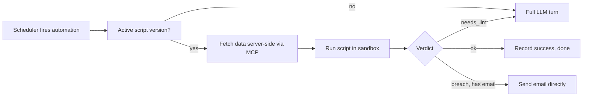

> **TL;DR** — Our scheduled automations ("alert me if CPA spikes") were running a full LLM turn on every single fire, even when there was nothing to say. I split automations into three modes, backed by a script that reports a structured verdict, so routine checks run as deterministic code and the model gets invoked only when something actually needs judgment.

## The symptom

At Strique, agents can be scheduled to check in periodically: "tell me if any campaign's CPA goes above $40," "send me a weekly spend digest every Monday." The first version of this was simple and, in hindsight, wasteful: every time the schedule fired, we kicked off a full agent turn. The model called a tool to fetch the metrics, looked at the numbers, decided nothing was wrong, and wrote a sentence to that effect. Then it went back to sleep until the next fire.

That's a full LLM turn — tool calls, reasoning, a generated response — to arrive at "no news." Multiply that by every automation a user sets up, on whatever cadence they choose, and you get a lot of model calls whose entire output is "nothing happened." It's not just a cost problem, though it is that. It's also a latency and reliability problem: every fire depends on a model being available and behaving, for work that a five-line comparison could have done.

The first instinct is to make the LLM call cheaper — smaller model, tighter prompt, more caching. That helps, but it doesn't address the actual shape of the problem: most automation fires need zero judgment. "Is this number bigger than that number" doesn't need a language model. What needs a model is deciding *whether* something needs a model.

## Three modes, one contract

I set a hard requirement for the redesign: support three distinct modes for any automation, not just "LLM always" or "script always."

1. **Pure LLM** — the original behavior, unchanged. Some tasks genuinely need reasoning every time (e.g., open-ended digests where the model has to decide what's worth surfacing).
2. **Pure script** — deterministic code, including sending the email if one is needed, with zero LLM calls in the common case.
3. **Hybrid** — the script runs first and decides for itself whether an LLM is actually needed this time.

The trick that makes all three modes work through the same machinery is a verdict contract. When a script runs, its *last line of stdout* must be a single JSON object:

```python
# Simplified shape of what a monitoring script prints as its final line
import json

def report_verdict(status: str, summary: str, details: dict) -> None:
    # status is one of: "ok", "breach", "needs_llm"
    print(json.dumps({
        "status": status,
        "summary": summary,
        "details": details,
    }))

# example: script fetched CPA, compared it to a threshold
if cpa > threshold:
    report_verdict("breach", f"CPA hit {cpa}, above the {threshold} limit", {"cpa": cpa})
else:
    report_verdict("ok", "CPA within range", {"cpa": cpa})
```

The runner reads that last line and branches:

- `ok` → nothing to do. Record the success, no conversation is ever created, no LLM is touched.
- `breach` → this is the interesting case. The verdict can carry its own pre-written email (subject and body), which the runner sends directly. A script that both detects the problem and drafts the alert never has to hand off to a model at all.
- `needs_llm` → the script decided it doesn't have enough judgment to finish the job itself (an ambiguous trend, something outside its rules), so it hands off to a real LLM turn, seeded with whatever context the script already gathered. The model isn't starting cold, it's starting from a verdict.



Scripts are versioned and immutable — every edit creates a new version and disables the previous one, so a script that's misbehaving can be rolled back without losing the history of what changed and when. If a script fails three fires in a row, it auto-disables and the automation quietly falls back to pure LLM mode rather than failing silently forever.

## Security by construction, not by review

The moment you let an LLM write and schedule code that runs unattended, you've created a new category of risk: what if the generated script tries to read something it shouldn't, or send an alert somewhere it shouldn't? I didn't want to solve this by reviewing every generated script by hand, because that doesn't scale and humans get complacent. So the constraints are structural:

- **Data never gets fetched by the script itself.** The data the script needs (campaign metrics, spend, whatever) is fetched *server-side* through our MCP layer, before the sandbox even starts, and written into the sandbox's workspace as plain files. The script reads files. It never holds a credential, never makes an authenticated API call. There's nothing to leak because there's nothing sensitive available to leak.
- **The alert recipient is locked to the automation's owner.** A verdict's email object can set a subject and body, but not a `to` address — if it tries, that field is simply ignored. This closes an obvious exfiltration path: a compromised or badly-prompted script can't redirect an alert to an address it doesn't own.
- **Auto-disable after repeated failure.** Three consecutive failures degrade the automation to LLM-only, rather than letting a broken script fire silently (or noisily) forever.

None of this is exotic. It's the same "treat generated code as hostile, give it the least possible surface area" instinct you'd apply to any sandboxed execution environment. The point is that the safety property doesn't depend on the script's author (human or model) getting it right; it depends on what the script is *capable* of doing, which we control.

## The UX bug that taught me the toggle has to be the source of truth

The trickiest bugs here weren't in the runner, they were in the boundary between "what the user thinks is happening" and "what's actually configured." The most instructive one: automations can be created from a template, and templates can bundle a script. We had a toggle in the UI for "run this as a script" vs. "run this with AI." But creating from a template with that toggle switched *off* still silently attached the template's script server-side — so the dialog said "AI," while the task that actually got scheduled ran deterministic code.

That's a trust bug more than a functional one. The fix was to make the toggle carry real, explicit state — not "on unless a template says otherwise," but a tri-state decision: off means off, full stop, even if a template would have suggested a script. The template is still validated for compatibility, but the user's explicit choice always wins. It sounds obvious written down; it wasn't obvious while debugging why a user's "AI-only" automation was returning script-shaped verdicts.

The second lesson was about how automation runs report their own status. Automations don't hold a live chat connection the way a normal conversation does — they can go quiet for tens of seconds while a script runs in a sandbox. Our stream tracking used to treat "no active stream, but the conversation isn't finished" as a sign the run had died and mark it as failed. For a scripted automation that's silent by design while it works, that's simply wrong. The fix was to give every automation run a real stream lease with periodic heartbeats, so "quiet because nothing to report yet" is distinguishable from "actually dead." A run in progress is never wrongly declared failed just because it isn't talking.

## What I'd tell someone building the same thing

If you're building scheduled automations for an agent system, resist making every fire a model call by default. Push as much of the "is there anything to say" decision as possible into deterministic code, and design the contract so the model only enters when a script itself says it's out of its depth. That single verdict field — ok, breach, needs_llm — is a small piece of API surface, but it's the hinge the whole design turns on: it's what lets pure LLM, pure script, and hybrid all be different configurations of the same runner, instead of three separate code paths to maintain.

And don't treat "the script decided" as automatically safe. Lock down what the script can reach — data in, alert recipient, nothing else — so the security property survives even a script you didn't personally review.

## Key takeaways

- Most scheduled checks don't need a model; they need a comparison. Design your automation runner so "nothing happened" is free.
- A small, structured verdict contract (status + summary + details) is enough to let the same runner support pure LLM, pure script, and hybrid modes without forking the code path.
- Fetch data server-side and hand the script files, not credentials — the security guarantee should come from what the script *can* reach, not from trusting what it will do.
- Lock alert recipients to the automation owner; ignore any recipient the script itself tries to specify.
- UI toggles that "usually" reflect reality aren't good enough for anything security- or trust-adjacent — make the explicit choice carry real, unambiguous state.
- Long-running background work needs its own liveness signal (a lease with heartbeats); don't reuse "no active stream" as a proxy for "dead," or you'll mark healthy silent work as failed.
