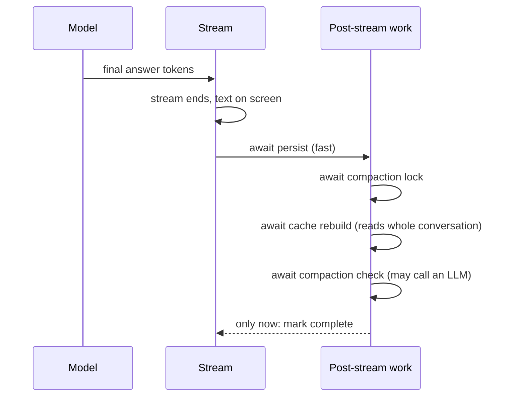
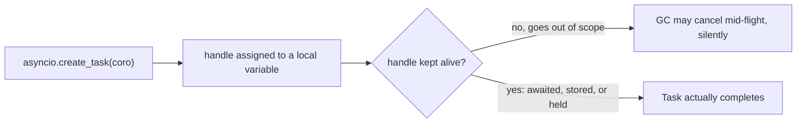

> **TL;DR** — After a long answer finished streaming, users waited about a minute before the turn was marked done. It wasn't the database write, that was already a single fast commit. It was cache rebuilds and compaction running inline, awaited before the stream could close. I split the work by durability: the write that must survive a crash stays inline, the work that can safely rebuild itself moves to the background. Getting "background" right took a second fix, because a dropped task handle in asyncio can vanish before it finishes.

## The symptom

A long conversation in our AI marketing platform, one with a lot of tool calls behind it, would finish streaming its final answer and then just sit there. The text was fully on screen, but the UI's "thinking" indicator kept spinning for something like a minute before the turn was finally marked complete. Nothing looked broken exactly, the answer was correct, but it felt broken: the model was clearly done, and the app disagreed.

## The obvious suspect was wrong

My first assumption was database writes. Persisting a long agent turn means writing a chunk of message rows, tool call rows, maybe reasoning blocks, all after the fact. Slow batched inserts are a classic tail-latency story, so I went looking for N+1 writes or an unbatched loop.

It wasn't there. The actual persistence step was already a single, fast, batched commit. Whatever was eating a minute, it wasn't the part I expected.

## The real root cause

The function that ran after the stream finished and before it was allowed to signal "done" did four things, in sequence, all awaited:

1. Persist the final message and tool call rows (fast, one commit).
2. Wait for any in-flight compaction task to finish.
3. Rebuild the conversation's context cache, which re-reads the *entire* conversation history.
4. Check whether this turn should trigger a fresh compaction pass, which can itself run an LLM call to summarize.

Step 1 was fast. Steps 2 through 4 were not, and they got slower as the conversation got longer, because rebuilding a cache from the whole conversation is, structurally, an operation whose cost grows with the conversation. On a long, tool-call-heavy turn, that's exactly the shape of conversation this pipeline sees the most.



The user's screen showed a finished answer while the backend was still doing bookkeeping that had nothing to do with delivering that answer.

## The fix: split the work by durability

The fix wasn't "make everything faster," it was recognizing that these four steps aren't equally important to finish before the stream closes. The distinction that mattered was durability: what happens if this step is lost because the process crashed right after the stream ended?

- **Persisting the final message is not safe to lose.** If it doesn't happen, a page reload shows an incomplete turn. That has to stay inline, awaited, before "done" is signaled.
- **The cache rebuild and the compaction check are safe to lose.** The cache rebuilds itself from the database on the next request that needs it. Compaction re-evaluates on the next turn regardless. Losing either one on a crash just means slightly more work happens later; it doesn't lose the user's data.

So I split them. The durable write stays inline. The rebuildable work gets detached into the background, fired as soon as the durable write completes, without the stream waiting on it.

```python
# Simplified: split by what must survive a crash vs. what can rebuild itself
async def finish_turn(turn):
    await persist_final_messages(turn)   # durable, must be awaited
    spawn_background_task(rebuild_cache_and_maybe_compact(turn))
    mark_stream_complete(turn)           # fires immediately after
```

That alone should have fixed it. It mostly did, and then it silently didn't, some of the time.

## The asyncio trap

`asyncio.create_task` only keeps a *weak* reference to the task it creates. If you fire a task and don't keep the handle it returns, alive somewhere, the garbage collector is free to reclaim it mid-flight. It doesn't raise an error. It doesn't log anything. The coroutine just stops running, wherever it happened to be, and nothing downstream ever finds out.



This is exactly the kind of bug that's invisible in a quick test and real in production: under light load, garbage collection doesn't happen to run at the wrong moment, so the fire-and-forget task usually completes and you conclude the fix works. Under real traffic, with the interpreter under more pressure, some fraction of those background tasks get collected before they finish, and a cache rebuild that should have happened just silently didn't. Nothing crashes. Something is simply, quietly, a little stale.

The fix was a small helper that holds a strong reference to every background task until it completes, then drops the reference. Fire-and-forget work goes through that helper, never through a bare `create_task` whose return value gets thrown away.

```python
# Simplified: a strong-reference holder so background tasks can't be GC'd mid-flight
_background_tasks: set[asyncio.Task] = set()

def spawn_background_task(coro) -> asyncio.Task:
    task = asyncio.create_task(coro)
    _background_tasks.add(task)
    task.add_done_callback(_background_tasks.discard)
    return task
```

It's a small amount of code. What it buys is a guarantee: a task you fire through this helper either runs to completion or fails loudly, and it's never silently dropped by the garbage collector because nothing else happened to be holding a reference to it.

## The trade-off I didn't take

The obvious "more correct" alternative is a real durable job queue: push the rebuild and compaction work onto something like a persisted queue with retries, so even a hard crash guarantees the work eventually runs. I considered it and rejected it, for now. It would trade a rare, cheap failure mode, losing a cache rebuild that regenerates itself next request anyway, for a real one: a durable queue means the background work can now run *after* a client has already refetched the conversation, which opens an eventual-consistency race where the user reloads into a state that's about to change under them. The current design's worst case is "occasionally a little more work happens on the next request." A queue's worst case, done carelessly, is "the UI shows something that's already wrong." I'd rather ship the smaller, well-understood risk.

## What I'd tell someone building the same thing

Before you optimize a "why is this slow after it looks done" problem, separate the work into what must be durable and what can be recomputed. That split alone usually tells you what can move to the background, without needing to make anything individually faster.

And if your fix involves "fire this in the background," don't stop until you've confirmed the runtime you're using actually keeps that work alive. In asyncio specifically, a dropped task handle is a silent failure, not a loud one, which makes it exactly the kind of bug that survives code review and a quick manual test, then shows up as a small, hard-to-reproduce data gap in production weeks later.

## Key takeaways

- When something looks done but the UI won't confirm it, check what's awaited *after* the visible work finishes, not just the visible work itself.
- Split post-completion work by durability: what must survive a crash stays inline and awaited; what can safely rebuild itself moves to the background.
- In asyncio, `create_task` holds only a weak reference. A dropped handle can be garbage-collected mid-flight with no error, no log, nothing. Hold a strong reference until the task completes.
- A fully durable job queue is not automatically the safer choice. It can trade a cheap, self-healing failure mode for a real consistency race; weigh both before reaching for it.
- Fixes to "silent" failure modes need their own regression test, because the failure itself produces no signal to catch it otherwise.
